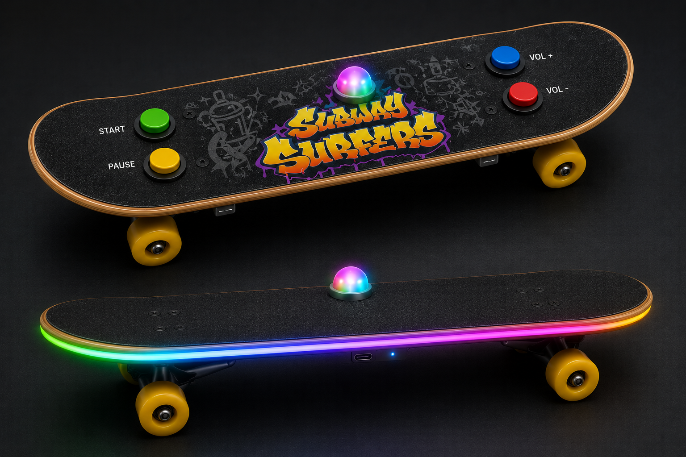

---

# Controle para Subway Surfers com Skate Inteligente (IoT & TinyML)

## 🛹 Sobre o Projeto

Este projeto consiste no desenvolvimento de um controle físico imersivo para o jogo *Subway Surfers*, utilizando um skate de verdade como interface principal de movimentação. A ideia é elevar a experiência do jogador, traduzindo os movimentos reais do skate (inclinar, "pular", "abaixar") para os comandos do personagem dentro do jogo.

O grande diferencial deste projeto é a integração de **Inteligência Artificial (TinyML/DSP)** processada diretamente no microcontrolador (Edge Computing) em conjunto com a **Comunicação Bluetooth**, garantindo alta precisão no reconhecimento dos movimentos e baixa latência na resposta do jogo.

---

## 🧠 A Ideia do Controle e Inteligência Artificial

Ao invés de utilizar verificações simples de limiares (thresholds) que podem gerar falsos positivos, o controle utiliza um **Sensor IMU (Acelerômetro + Giroscópio)** que coleta continuamente os dados de movimentação do skate.

Esses dados alimentam um modelo de **Machine Learning** treinado (via Edge Impulse/TensorFlow Lite for Microcontrollers) especificamente com os movimentos reais do skate. A IA classifica a intenção do jogador em tempo real (ex: desviar para esquerda/direita, pular ou rolar) e torna a jogabilidade muito mais fluida e previsível.

Além do movimento, o controle conta com:

- **LED RGB:** Muda de cor dinamicamente de acordo com o movimento classificado pela IA, fornecendo feedback visual em tempo real.
- **Botões Auxiliares:**
  - **START:** Inicia a partida.
  - **PAUSE:** Pausa o jogo.
  - **VOLUME + / VOLUME -:** Controle de áudio.

---

## 🎯 Objetivos do Projeto

- Desenvolver uma interface física interativa e imersiva para jogos digitais;
- Coletar dados e treinar um modelo de **Machine Learning (DSP/IA)** para classificação de padrões de movimento;
- Executar inferência de IA em tempo real no microcontrolador (Edge AI);
- Utilizar comunicação **Bluetooth** para transmissão sem fio dos comandos classificados para o computador;
- Aplicar conceitos avançados de **RTOS** (Real-Time Operating System), paralelismo, filas e semáforos.

---

## 🔌 Inputs e Outputs

### Inputs (Entradas)

- **IMU (Acelerômetro e Giroscópio):** Captura a física do movimento do skate nos eixos X, Y e Z.
- **4 Botões de Controle:** Start, Pause, Volume+ e Volume-.

### Outputs (Saídas)

- **Módulo Bluetooth:** Envia os comandos já processados e classificados pela IA para o computador rodando o jogo.
- **LED RGB:** Feedback visual do estado do controle e das ações reconhecidas.

---

## ⚙️ Arquitetura do Firmware (RTOS)

O sistema foi arquitetado utilizando FreeRTOS para garantir o cumprimento dos requisitos de tempo real, tanto da amostragem do sensor quanto da comunicação Bluetooth.

### Tasks

#### `task_sensor_ai`

Responsável por ler os dados brutos da IMU em uma frequência fixa, preencher os buffers de amostragem e executar o modelo de Inteligência Artificial.

Após realizar a inferência e classificar o movimento (ex: *Jump*, *Left*, *Right*), envia o resultado para a `task_bluetooth` e para a `task_led`.

#### `task_bluetooth`

Atua como a ponte de comunicação. Recebe as intenções de movimento classificadas pela IA e os comandos dos botões, formatando e enviando os dados via Bluetooth para o PC.

---

#### `task_led`

Gerencia a cor e as animações do LED RGB com base no movimento classificado recebido da `task_sensor_ai`.

---

## 📬 Filas (Queues)

### `xQueueMotion`

Transporta o resultado da classificação da IA (e não apenas dados brutos) da `task_sensor_ai` para a `task_bluetooth`.

---

### `xQueueButtons`

Transporta os eventos tratados dos botões (qual botão foi apertado) da interrupção/task de botões para a `task_bluetooth`.

---

### `xQueueLed`

Envia o estado atual do movimento da `task_sensor_ai` para atualizar o feedback visual na `task_led`.

---

## ⚡ Interrupções (ISR)

### `gpio_irq_handler`

Rotina de interrupção de hardware acionada pelas bordas de descida/subida dos botões.

Libera a leitura na fila `xQueueButtons` ou acorda a `task_buttons` de forma imediata e econômica (sem polling contínuo).

---

# 🎮 Protótipo do Controle

---