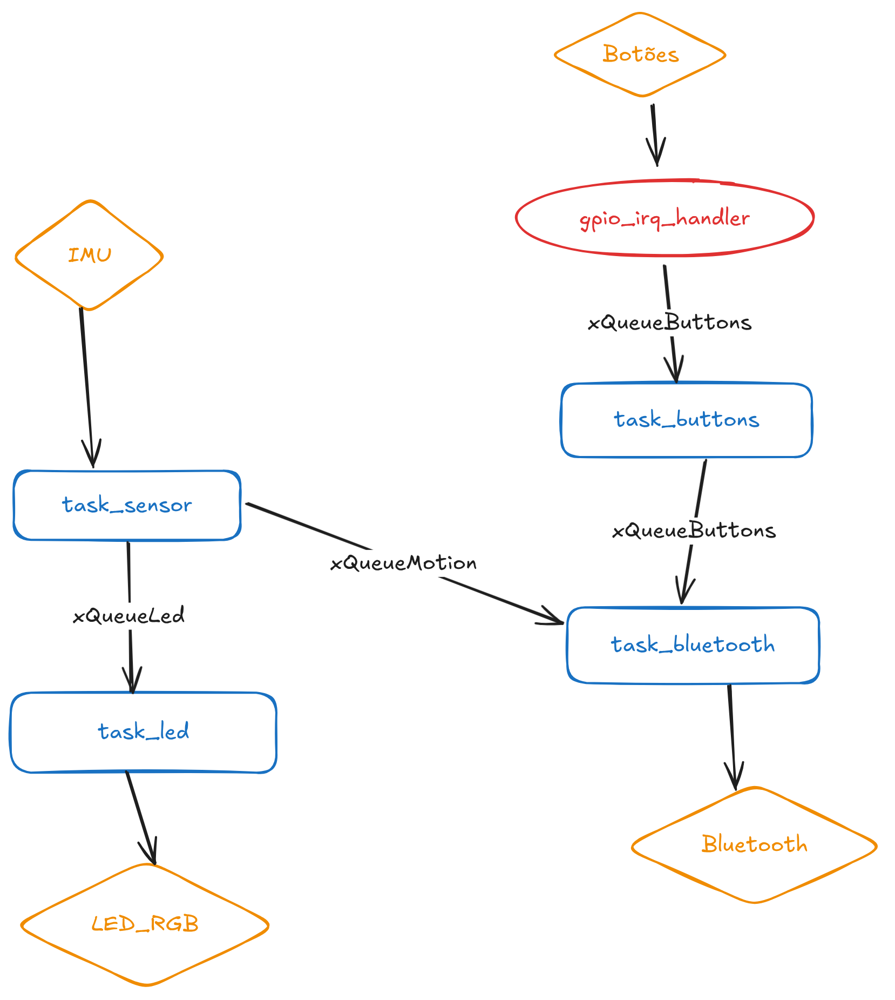

# Controle para Subway Surfers com Skate

## Jogo
O projeto consiste em um controle físico para o jogo *Subway Surfers*, utilizando um skate como interface principal de movimentação. A ideia é tornar a experiência mais imersiva, fazendo com que os movimentos reais do skate controlem o personagem dentro do jogo.

---

# Ideia do Controle
O controle será baseado nos movimentos do skate. Sensores instalados no sistema irão detectar inclinações e movimentações, permitindo controlar as ações do jogo, como desviar para os lados, pular ou abaixar.

Um **LED RGB** instalado no skate muda de cor de acordo com o movimento detectado, dando feedback visual ao jogador em tempo real.

Além disso, o sistema contará com quatro botões auxiliares:

- Botão **START** → inicia o jogo;
- Botão **PAUSE** → pausa o jogo;
- Botão **VOLUME +** → aumenta o volume;
- Botão **VOLUME -** → diminui o volume.

## Objetivos do Projeto
- Criar uma interface física interativa para jogos;
- Utilizar comunicação Bluetooth para enviar comandos ao computador;
- Aplicar conceitos de RTOS, sensores e comunicação serial;
- Integrar conceitos dos experts de IA e Bluetooth.

---

# Inputs e Outputs

## Inputs (Entradas)
Sensores e dispositivos utilizados para capturar informações:

- Sensor de movimento/inclinação (IMU — acelerômetro e giroscópio);
- 4 botões:
  - Start
  - Pause
  - Volume +
  - Volume -

## Outputs (Saídas)
Dispositivos responsáveis por resposta visual ou comunicação:

- LED RGB (feedback visual do movimento);
- Comunicação Bluetooth com o computador;
- Envio de comandos para o jogo.

---

# Protocolo Utilizado
O sistema utilizará comunicação **Bluetooth** para transmitir os comandos do controle ao computador.

Os dados enviados representarão:
- direção do movimento;
- ações do skate;
- comandos dos botões.

---

# Diagrama de Blocos do Firmware

## Tasks
- `task_sensor`
  - Lê a IMU e envia comandos de movimento para `task_bluetooth` e `task_led`.

- `task_buttons`
  - Recebe eventos dos botões, faz o tratamento/debounce e envia comandos para `task_bluetooth`.

- `task_bluetooth`
  - Recebe comandos de movimento e botões, e envia via Bluetooth para o computador.

- `task_led`
  - Controla o LED RGB com base no movimento detectado.

---

## Filas
- `xQueueMotion`
  - Envia dados de movimento da `task_sensor` para `task_bluetooth`.

- `xQueueButtons`
  - Envia eventos dos botões para `task_bluetooth`.

- `xQueueLed`
  - Envia dados de movimento da `task_sensor` para `task_led`.

---

## ISR (Interrupções)
- `gpio_irq_handler`
  - Captura interrupções dos botões e envia eventos para a `task_buttons` usando a fila `xQueueButtons`.

---

## Diagrama

